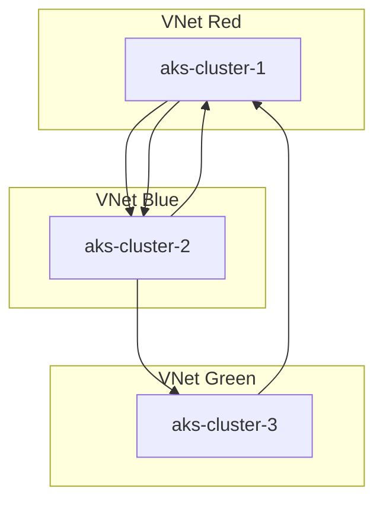
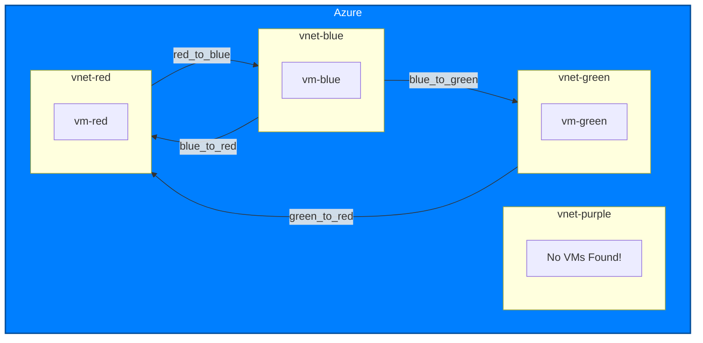

# oracle-infra-audit
A take-home assignment from Oracle for auditing a network. My task was to create a collection of resources, then audit their inter-connectivity. I chose to audit a specific layer of the OSI model.

## Implementation Summary
I used Terraform to create 3 clusters and 3 networks. Each cluster has an associated virtual network subnet.

- AKS Cluster: aks-cluster-1 (lives in VNet: vnet-red)
- AKS Cluster: aks-cluster-2 (lives in VNet: vnet-blue)
- AKS Cluster: aks-cluster-3 (lives in VNet: vnet-green)

I connected the first 2 networks (red and blue) using mutual network-peering routes. I created an additional network peering from green to red (but not vice versa). This made red a "hub" and blue and green became spokes. This allowed green to communicate with blue, through red.

This audit.py output shows the hub and spoke connectivity of all three clusters:

    Reciprocal Peering Groups:
    Peering Group 1:
      - AKS Cluster: aks-cluster-1 (in VNet: vnet-blue)
      - AKS Cluster: aks-cluster-2 (in VNet: vnet-blue)
      - AKS Cluster: aks-cluster-3 (in VNet: vnet-blue)
      - AKS Cluster: aks-cluster-1 (in VNet: vnet-red)
      - AKS Cluster: aks-cluster-2 (in VNet: vnet-red)
      - AKS Cluster: aks-cluster-3 (in VNet: vnet-red)
    --------------------------------------------------
    Isolated AKS Clusters:
    --------------------------------------------------

This audit.py output shows what happens when the green-red route does not exist:

    Reciprocal Peering Groups:
    Peering Group 1:
      - AKS Cluster: aks-cluster-1 (in VNet: vnet-blue)
      - AKS Cluster: aks-cluster-2 (in VNet: vnet-blue)
      - AKS Cluster: aks-cluster-1 (in VNet: vnet-red)
      - AKS Cluster: aks-cluster-2 (in VNet: vnet-red)
    --------------------------------------------------
    Isolated AKS Clusters:
    --------------------------------------------------
      - AKS Cluster: aks-cluster-3 (in VNet: vnet-green)

## How to deploy this configuration
Authenticate your Azure CLI session:
`sh
az login ;
export AZURE_SUBSCRIPTION_ID=$(az account show --query id --output tsv) ;
export MY_PUBLIC_IP=$(curl -s https://api.ipify.org) ;
cd ./terraform ;
terraform init ;
terraform apply -var "AZURE_SUBSCRIPTION_ID=${AZURE_SUBSCRIPTION_ID}" -var "MY_PUBLIC_IP=${MY_PUBLIC_IP}" -auto-approve ;
`

Run the audit script to get a routing table and markdown diagram:
`sh
cd ../python
chmod +x audit.py
./audit.py
``

Destroy the infra when done:
`terraform destroy -var "AZURE_SUBSCRIPTION_ID=${AZURE_SUBSCRIPTION_ID}" -var "MY_PUBLIC_IP=${MY_PUBLIC_IP}" -auto-approve ;`

## Conclusion
Azure virtual networks can be used to determine routing connectivity between resources within a resource group. They are particularly useful for creating hub-and-spoke topographies. For analysis, the python audit file's first version simply contains the peering routes to take for two-way traffic. It generates a very crude virtual network routing table. The python audit code uses a Peering dataclass, which allows the audit code to scale efficiently to other cloud providers by using a common data structure.

## Addendum
My first plan was to audit istio connections across clusters, but I did not have enough time to implement it in the allotted window. I would have been required to set up secure PKI, among other time-consuming tasks.

Later, I ran into a prohibitive Azure Terraform error when attempting to refactor. The error likely came from Azure's API being incredibly slow and taking forever to clean up resources:

    azurerm_kubernetes_cluster.aks_cluster_1: Creating...
    ╷
    │ Error: creating Kubernetes Cluster (Subscription: "a35492ef-d394-49c7-9d83-77aaa06d0fc0"
    │ Resource Group Name: "aks-resource-group"
    │ Kubernetes Cluster Name: "aks-cluster-1"): performing CreateOrUpdate: unexpected status 400 (400 Bad Request) with response: {
    │   "code": "ErrCode_InsufficientVCPUQuota",
    │   "details": null,
    │   "message": "Insufficient regional vcpu quota left for location eastus. left regional vcpu quota 0, requested quota 2",
    │   "subcode": ""
    │  }

This is a billing issue. I did not have enough time to troubleshoot billing.

This first draft of the assignment shows layer 3 connectivity (routing), instead of layer 7 (istio).

## Addendum 2
I was able to re-factor the code so that it can dynamically generate a diagram of the routing table. To do this, I shifted from an AKS-centric architecture to a normal VM-based architecture. This allowed me to circumvent quotas without needing to engage Azure support. The AKS clusters required too many resources.

If you are unable to provision instances due to an availability issue, use this command to find a different vm size:
`az vm list-skus --location centralus --size Standard_A --all --output table`

The markdown diagram output also contains a blue Azure container in the diagram, which should help in the event of a multi-cloud audit:

    Getting networking data...
    
    VNet peering routes:
    --------------------------------------------------
    - vnet-blue (['10.2.0.0/16']) --> vnet-red (['10.1.0.0/16'])
    - vnet-blue (['10.2.0.0/16']) --> vnet-green (['10.3.0.0/16'])
    - vnet-green (['10.3.0.0/16']) --> vnet-red (['10.1.0.0/16'])
    - vnet-red (['10.1.0.0/16']) --> vnet-blue (['10.2.0.0/16'])
    
    Isolated VNets:
    --------------------------------------------------
    - vnet-purple ['10.4.0.0/24']

Use this for testing ping ability:
`az extension add --name ssh ;
az vm ssh --name red --resource-group main-resource-group ; `

